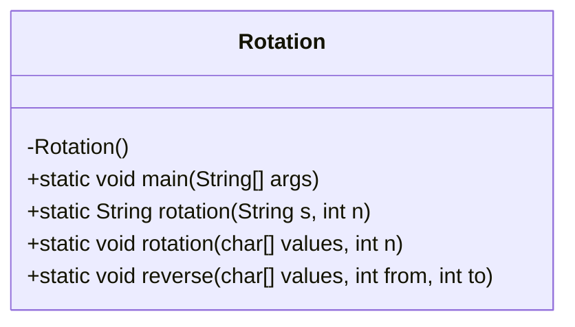
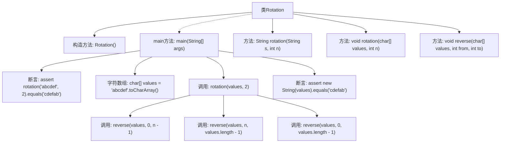

# 基础信息

|      |      |
|------|------|
| 名称 | Rotation |
| 编码语言 | .java |
| 代码路径 | Java/src/main/java/com/thealgorithms/strings/Rotation.java |
| 包名 | com.thealgorithms.strings |
| 依赖项 | [] |
| 概述说明 | Rotation类实现字符串和字符数组旋转，时间复杂度O(n)，空间复杂度O(n)或O(1)。 |

# 说明

Rotation类提供了对字符串和字符数组进行旋转操作的功能。其时间复杂度为O(n)，表示操作所需时间与输入规模成线性关系。空间复杂度有两种情况：O(n)表示需要额外空间与输入规模成正比，而O(1)表示只需常数级别的额外空间，与输入规模无关。该类设计高效，适用于不同场景下的旋转需求。

# 类列表 Class Summary

| 名称   | 类型  | 说明 |
|-------|------|-------------|
| Rotation | class | Rotation类实现字符串和字符数组的旋转操作，时间复杂度O(n)，空间复杂度O(n)或O(1)。 |

## 类 Rotation

|      |      |
|------|------|
| 访问范围 | public final |
| 类型 | class |
| 名称 | Rotation |
| 说明 | Rotation类实现字符串和字符数组的旋转操作，时间复杂度O(n)，空间复杂度O(n)或O(1)。 |

### UML类图

**描述：**  
`Rotation` 类是一个工具类，提供了字符串和字符数组的旋转操作。它包含三个静态方法：`rotation(String s, int n)` 用于将字符串的前 `n` 个字符移动到末尾，`rotation(char[] values, int n)` 用于将字符数组的前 `n` 个字符移动到末尾，`reverse(char[] values, int from, int to)` 用于反转字符数组中指定范围内的字符。该类通过反转操作实现了空间复杂度为 O(1) 的字符数组旋转。

### 内部方法调用关系图

这段代码定义了一个名为 `Rotation` 的类，包含两个 `rotation` 方法和一个 `reverse` 方法。`rotation` 方法用于将字符串或字符数组的前 `n` 个字符移动到末尾，`reverse` 方法用于反转字符数组的指定部分。`main` 方法通过断言验证了 `rotation` 方法的正确性。流程图展示了类的方法调用关系和执行顺序，帮助理解代码的逻辑流程。

### 字段列表 Field List

| 名称  | 类型  | 说明 |
|-------|-------|------|

### 方法列表 Method List

| 名称  | 类型  | 说明 |
|-------|-------|------|
| rotation | void | 旋转字符数组的前n个元素。 |
| rotation | String | 字符串旋转方法，将前n字符移至末尾。 |
| reverse | void | 反转字符数组指定区间的元素。 |
| main | void | Java代码示例：验证字符串旋转方法功能正确性。 |

