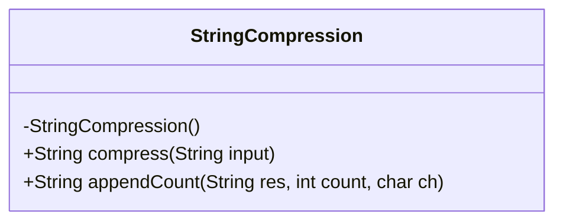
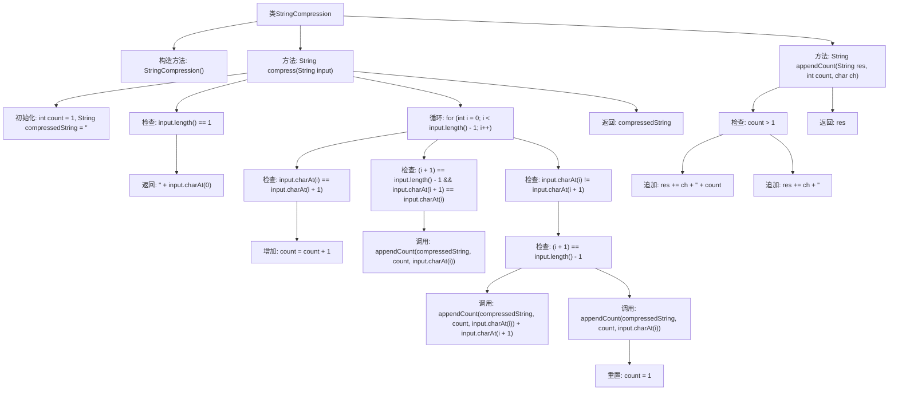

# 基础信息

|      |      |
|------|------|
| 名称 | StringCompression |
| 编码语言 | .java |
| 代码路径 | Java/src/main/java/com/thealgorithms/strings/StringCompression.java |
| 包名 | com.thealgorithms.strings |
| 依赖项 | [] |
| 概述说明 | 字符串压缩类统计连续相同字符并生成压缩字符串。 |

# 说明

字符串压缩类的主要功能是通过统计连续相同字符的数量，并生成相应的压缩字符串。该类会遍历输入字符串，记录每个字符连续出现的次数，然后将字符及其出现次数组合成压缩后的字符串。这种方法可以有效减少字符串的长度，特别是在处理大量重复字符的情况下，显著提高存储和传输效率。

# 类列表 Class Summary

| 名称   | 类型  | 说明 |
|-------|------|-------------|
| StringCompression | class | 字符串压缩类，通过统计连续相同字符并生成压缩字符串。 |

## 类 StringCompression

|      |      |
|------|------|
| 访问范围 | public final |
| 类型 | class |
| 名称 | StringCompression |
| 说明 | 字符串压缩类，通过统计连续相同字符并生成压缩字符串。 |

### UML类图

**描述：**  
`StringCompression` 类提供了一个静态方法 `compress`，用于将输入的字符串进行压缩。该方法通过遍历字符串中的字符，统计连续相同字符的数量，并将结果拼接成压缩后的字符串。另一个静态方法 `appendCount` 用于将字符及其计数追加到结果字符串中。该类是一个工具类，因此构造函数被私有化，防止实例化。

### 内部方法调用关系图

**描述：**
该代码实现了一个字符串压缩算法，通过遍历输入字符串并统计连续相同字符的数量，生成压缩后的字符串。流程图展示了从初始化变量、检查输入字符串长度、遍历字符、调用`appendCount`方法追加字符和计数，到最后返回压缩字符串的完整流程。每个步骤都通过条件判断和循环控制逻辑，确保正确生成压缩结果。

### 字段列表 Field List

| 名称  | 类型  | 说明 |
|-------|-------|------|

### 方法列表 Method List

| 名称  | 类型  | 说明 |
|-------|-------|------|
| compress | String | 压缩字符串，统计相邻相同字符数量并生成压缩结果。 |
| appendCount | String | 静态方法将字符及其计数附加到字符串，若计数大于1则附加字符和计数，否则仅附加字符。 |

