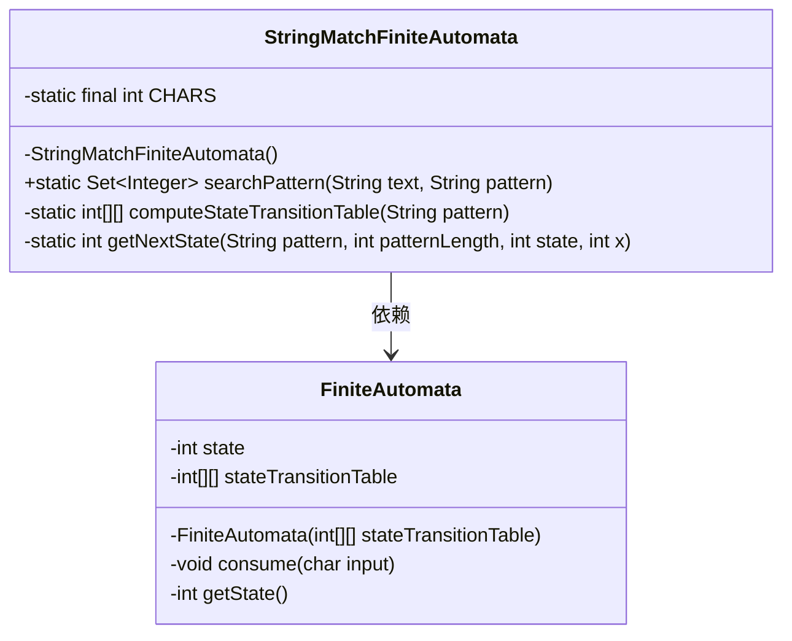
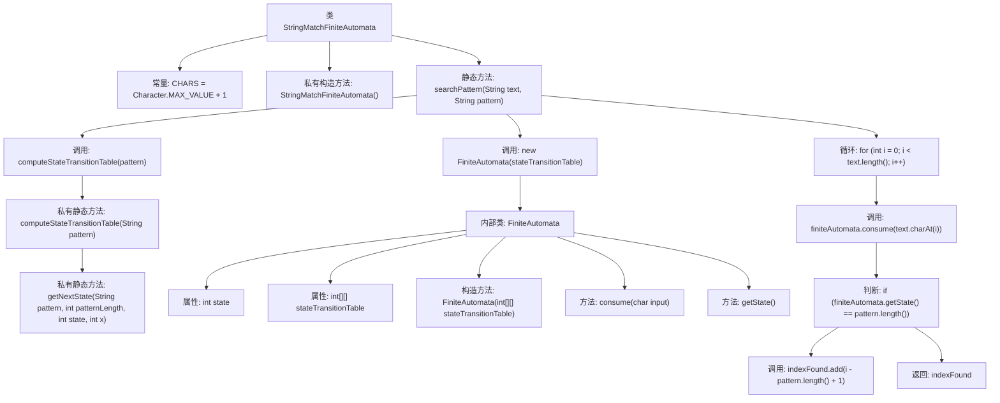

# 基础信息

|      |      |
|------|------|
| 名称 | StringMatchFiniteAutomata |
| 编码语言 | .java |
| 代码路径 | Java/src/main/java/com/thealgorithms/strings/StringMatchFiniteAutomata.java |
| 包名 | com.thealgorithms.strings |
| 依赖项 | ['java.util.Set', 'java.util.TreeSet'] |
| 概述说明 | 有限自动机搜索文本模式，返回匹配起始索引。 |

# 说明

有限自动机是一种用于在文本中搜索特定模式的计算模型。通过构建状态转移图，自动机能够逐个字符地扫描文本，并根据当前状态和输入字符决定下一步的状态转移。当自动机达到接受状态时，表示找到了与模式匹配的子串，此时返回该子串在文本中的起始索引。这种方法高效且适用于多种模式匹配场景，能够快速定位文本中的目标模式。

# 类列表 Class Summary

| 名称   | 类型  | 说明 |
|-------|------|-------------|
| StringMatchFiniteAutomata | class | 使用有限自动机在文本中搜索模式，返回匹配的起始索引。 |

## 类 StringMatchFiniteAutomata

|      |      |
|------|------|
| 访问范围 | public final |
| 类型 | class |
| 名称 | StringMatchFiniteAutomata |
| 说明 | 使用有限自动机在文本中搜索模式，返回匹配的起始索引。 |

### UML类图

这段代码实现了一个基于有限自动机的字符串匹配算法。`StringMatchFiniteAutomata` 类包含静态方法 `searchPattern`，用于在给定文本中搜索指定模式。该类通过 `computeStateTransitionTable` 方法计算状态转移表，并使用 `FiniteAutomata` 类来模拟有限自动机的行为。`FiniteAutomata` 类负责状态的转换和当前状态的获取。整个流程通过状态转移表来匹配模式，并返回匹配成功的起始位置集合。

### 内部方法调用关系图

这段代码实现了一个基于有限自动机的字符串匹配算法。类`StringMatchFiniteAutomata`包含一个私有构造方法和三个静态方法，其中`searchPattern`方法用于在文本中搜索模式，`computeStateTransitionTable`方法用于计算状态转移表，`getNextState`方法用于确定下一个状态。内部类`FiniteAutomata`封装了有限自动机的状态和状态转移表，并提供了`consume`和`getState`方法来处理输入字符和获取当前状态。代码通过遍历文本字符并使用有限自动机进行状态转移，最终返回匹配模式的起始索引集合。

### 字段列表 Field List

| 名称  | 类型  | 说明 |
|-------|-------|------|
| CHARS = Character.MAX_VALUE + 1 | int | 定义常量CHARS为字符最大值加1。 |

### 方法列表 Method List

| 名称  | 类型  | 说明 |
|-------|-------|------|
| computeStateTransitionTable | int[][] | 计算模式串的状态转移表，返回二维数组。 |
| getNextState | int | 根据模式匹配字符更新状态，返回下一状态或0。 |
| searchPattern | Set<Integer> | 该方法使用有限自动机在文本中搜索模式，返回匹配的起始索引集合。 |

