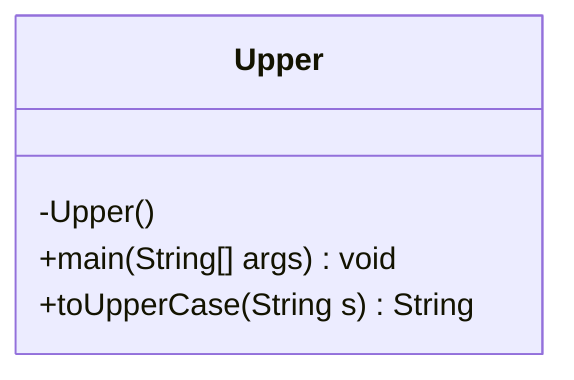
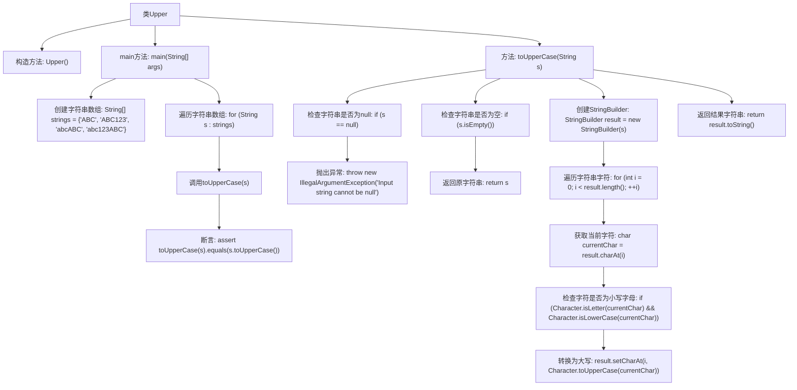

# 基础信息

|      |      |
|------|------|
| 名称 | Upper |
| 编码语言 | .java |
| 代码路径 | Java/src/main/java/com/thealgorithms/strings/Upper.java |
| 包名 | com.thealgorithms.strings |
| 依赖项 | [] |
| 概述说明 | Upper类实现字符串大写转换并验证结果。 |

# 说明

Upper类的主要功能是将输入的字符串转换为大写形式，并在转换后进行断言验证以确保转换结果的正确性。该类通过处理字符串的大小写转换，并利用断言机制来验证转换是否符合预期，从而保证功能的准确性和可靠性。

# 类列表 Class Summary

| 名称   | 类型  | 说明 |
|-------|------|-------------|
| Upper | class | Upper类将字符串转换为大写，并进行断言验证。 |

## 类 Upper

|      |      |
|------|------|
| 访问范围 | public final |
| 类型 | class |
| 名称 | Upper |
| 说明 | Upper类将字符串转换为大写，并进行断言验证。 |

### UML类图

类图描述：  
`Upper` 类是一个工具类，用于将字符串转换为大写。它包含一个私有的构造函数，防止实例化。`toUpperCase` 方法接受一个字符串参数，并返回其大写版本。该方法首先检查输入字符串是否为 `null` 或空字符串，然后使用 `StringBuilder` 逐个字符检查并转换为大写。`main` 方法用于测试 `toUpperCase` 方法，验证其输出与标准库的 `toUpperCase` 方法结果一致。

### 内部方法调用关系图

**描述：**  
这段代码定义了一个`Upper`类，主要功能是将字符串转换为大写。`main`方法中创建了一个字符串数组，并遍历数组中的每个字符串，调用`toUpperCase`方法进行转换，并使用断言验证转换结果是否正确。`toUpperCase`方法首先检查输入字符串是否为`null`或空字符串，然后使用`StringBuilder`逐个字符检查并转换为大写，最后返回转换后的字符串。流程图清晰地展示了类的构造、方法的调用以及字符处理的逻辑流程。

### 字段列表 Field List

| 名称  | 类型  | 说明 |
|-------|-------|------|

### 方法列表 Method List

| 名称  | 类型  | 说明 |
|-------|-------|------|
| main | void | Java代码验证字符串转换为大写后与原大写结果一致。 |
| toUpperCase | String | 将字符串转换为大写，处理空字符串和空值异常。 |

