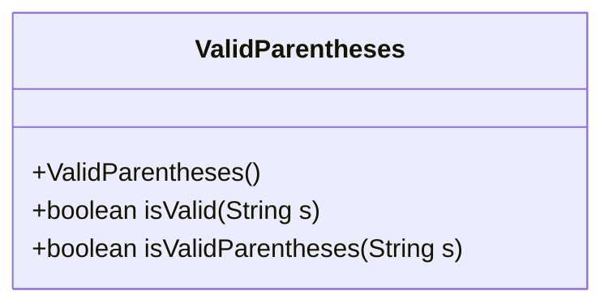
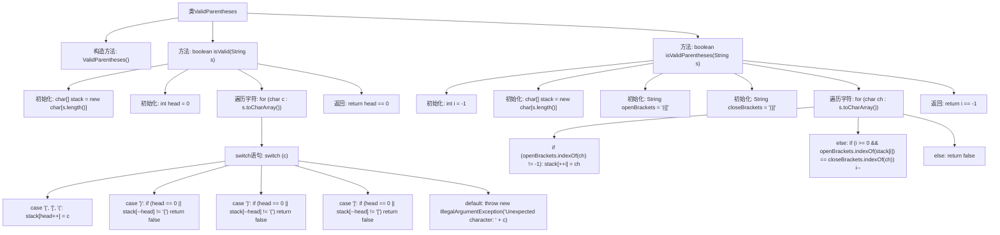

# 基础信息

|      |      |
|------|------|
| 名称 | ValidParentheses |
| 编码语言 | .java |
| 代码路径 | Java/src/main/java/com/thealgorithms/strings/ValidParentheses.java |
| 包名 | com.thealgorithms.strings |
| 依赖项 | [] |
| 概述说明 | 验证字符串中括号是否匹配有效。 |

# 说明

该任务要求验证给定字符串中的括号是否匹配且有效。具体来说，需要检查字符串中的各种括号（如圆括号、方括号、花括号等）是否正确配对，即每个打开的括号都有相应的闭合括号，并且括号的嵌套顺序正确。这一过程通常涉及遍历字符串，使用栈数据结构来跟踪未闭合的括号，并在遇到闭合括号时检查是否与栈顶的括号匹配。如果所有括号都正确匹配且栈最终为空，则字符串中的括号是有效的；否则，无效。

# 类列表 Class Summary

| 名称   | 类型  | 说明 |
|-------|------|-------------|
| ValidParentheses | class | 验证字符串中的括号是否匹配有效。 |

## 类 ValidParentheses

|      |      |
|------|------|
| 访问范围 | public final |
| 类型 | class |
| 名称 | ValidParentheses |
| 说明 | 验证字符串中的括号是否匹配有效。 |

### UML类图

这段代码定义了一个名为 `ValidParentheses` 的类，该类包含两个静态方法 `isValid` 和 `isValidParentheses`，用于检查给定的字符串是否包含有效的括号匹配。`isValid` 方法通过使用栈数据结构来匹配括号，而 `isValidParentheses` 方法则通过索引和字符串匹配来实现相同的功能。这两个方法都返回一个布尔值，表示字符串中的括号是否有效匹配。由于 `ValidParentheses` 类的构造函数是私有的，因此该类不能被实例化，只能通过静态方法调用其功能。

### 内部方法调用关系图

这段代码定义了一个名为 `ValidParentheses` 的类，包含两个静态方法 `isValid` 和 `isValidParentheses`，用于检查字符串中的括号是否有效。`isValid` 方法通过栈结构逐个检查字符，确保括号匹配；`isValidParentheses` 方法则使用索引和字符串匹配来实现相同的功能。两个方法最终都返回布尔值，表示括号是否有效。

### 字段列表 Field List

| 名称  | 类型  | 说明 |
|-------|-------|------|

### 方法列表 Method List

| 名称  | 类型  | 说明 |
|-------|-------|------|
| isValid | boolean | 使用栈检查字符串中的括号是否有效匹配。 |
| isValidParentheses | boolean | 该方法检查字符串中的括号是否有效匹配。 |

