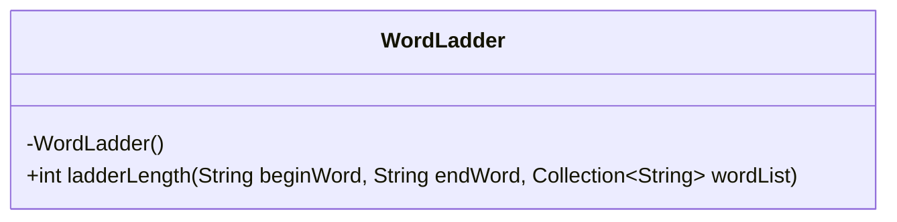
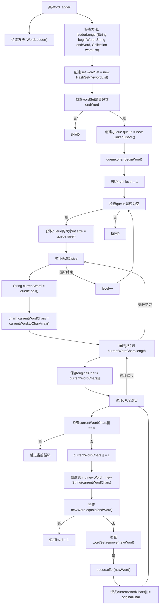

# 基础信息

|      |      |
|------|------|
| 名称 | WordLadder |
| 编码语言 | .java |
| 代码路径 | Java/src/main/java/com/thealgorithms/strings/WordLadder.java |
| 包名 | com.thealgorithms.strings |
| 依赖项 | ['java.util.Collection', 'java.util.HashSet', 'java.util.LinkedList', 'java.util.Queue', 'java.util.Set'] |
| 概述说明 | WordLadder类用于查找最短词转换序列，无序列时返回0。 |

# 说明

WordLadder类的主要功能是查找从给定的起始词到目标词的最短转换序列。它通过一系列步骤将起始词逐步转换为目标词，每次转换只改变一个字母，且每次转换后的词必须存在于词典中。如果存在这样的转换序列，WordLadder类将返回该序列的长度；如果无法找到任何有效的转换序列，则返回0。该类的核心目标是高效地确定最短转换路径，确保结果的准确性和最优性。

# 类列表 Class Summary

| 名称   | 类型  | 说明 |
|-------|------|-------------|
| WordLadder | class | WordLadder类用于查找从起始词到目标词的最短转换序列，返回序列长度或无序列时返回0。 |

## 类 WordLadder

|      |      |
|------|------|
| 访问范围 | public final |
| 类型 | class |
| 名称 | WordLadder |
| 说明 | WordLadder类用于查找从起始词到目标词的最短转换序列，返回序列长度或无序列时返回0。 |

### UML类图

**描述：**  
`WordLadder` 类是一个工具类，用于计算从 `beginWord` 到 `endWord` 的最短转换序列的长度。该类包含一个私有构造函数，确保无法实例化。`ladderLength` 方法接受起始词、目标词和词列表作为参数，通过广度优先搜索（BFS）算法找到最短转换序列的长度。如果无法找到转换序列，则返回 0。该方法通过逐字符替换和队列操作来探索所有可能的转换路径。

### 内部方法调用关系图

这段代码实现了一个单词梯子算法，用于找到从起始单词到目标单词的最短转换序列。代码通过广度优先搜索（BFS）遍历所有可能的单词变换，并在找到目标单词时返回转换序列的长度。流程图展示了从初始化到最终返回结果的完整流程，包括单词集合的创建、队列的使用、字符变换的循环以及条件判断等关键步骤。

### 字段列表 Field List

| 名称  | 类型  | 说明 |
|-------|-------|------|

### 方法列表 Method List

| 名称  | 类型  | 说明 |
|-------|-------|------|
| ladderLength | int | 该方法计算从起始词到目标词的最短转换路径长度，使用广度优先搜索和字符替换策略。 |

