# 基础信息

|      |      |
|------|------|
| 名称 | strings |
| 编码语言 | .java |
| 代码路径 | Java/src/main/java/com/thealgorithms/strings |
| 包名 | Java.src.main.java.com.thealgorithms.strings |
| 概述说明 | Java类实现多种字符串操作，包括字母顺序检查、字符统计、回文检测、模式匹配、子串查找、大小写转换、变位词验证、字符串反转、括号匹配、单词计数、同构检查、旋转操作、公共前缀查找、字符一致性验证、自动机匹配、排列生成、元音检查、电话键盘字母组合、字符串转整数、子序列生成、哈希匹配、KMP算法、变位词检测、单词转换、全字母句检测、最长不重复子串、小写转换、汉明距离计算、单词反转、回文子串查找、字符串压缩、Z形编码等。 |

# 说明

## 概述

该代码模块是一个专注于字符串处理的工具集，提供了多种字符串操作和算法实现。模块涵盖了字符串的检查、转换、匹配、压缩、排列等多种功能，适用于各种字符串处理场景。这些工具通过不同的算法和数据结构，高效地解决了字符串处理中的常见问题，如回文检测、模式匹配、字符统计、字符串反转等。模块中的每个类和方法都经过精心设计，确保其功能准确性和性能优化。

## 主要业务场景

1. **字符串检查与验证**：
   - 检查字符串是否按字母顺序排列（`Alphabetical`）。
   - 验证字符串是否为回文（`Palindrome`）。
   - 检查字符串中的括号是否有效匹配（`ValidParentheses`）。
   - 验证字符串是否为变位词（`CheckAnagrams`, `Anagrams`）。
   - 检查字符串是否包含元音字母（`CheckVowels`）。
   - 验证字符串是否为全字母句（`Pangram`）。
   - 检查字符串中的所有字符是否相同（`CharactersSame`）。

2. **字符串转换与操作**：
   - 将字符串转换为大写或小写形式（`Upper`, `Lower`）。
   - 反转字符串或单词顺序（`ReverseString`, `ReverseStringRecursive`, `ReverseWordsInString`）。
   - 旋转字符串或字符数组（`Rotation`）。
   - 生成字符串的所有子序列或排列（`ReturnSubsequence`, `PermuteString`）。
   - 生成电话键盘数字对应的字母组合（`LetterCombinationsOfPhoneNumber`）。

3. **字符串匹配与搜索**：
   - 使用AhoCorasick算法进行多模式字符串匹配（`AhoCorasick`）。
   - 使用Manacher算法查找最长回文子串（`Manacher`）。
   - 使用Horspool算法进行模式串搜索（`HorspoolSearch`）。
   - 使用RabinKarp算法进行字符串模式匹配（`RabinKarp`）。
   - 使用KMP算法进行高效字符串匹配（`KMP`）。
   - 使用有限自动机进行模式匹配（`StringMatchFiniteAutomata`）。

4. **字符串统计与分析**：
   - 统计字符串中的非空白字符数量（`CountChar`）。
   - 统计字符串中的单词数量（`CountWords`）。
   - 计算字符串的汉明距离（`HammingDistance`）。
   - 查找字符串中的最长不重复子串（`LongestNonRepetitiveSubstring`）。
   - 查找字符串数组中的最长公共前缀（`LongestCommonPrefix`）。

5. **字符串压缩与编码**：
   - 压缩字符串，统计连续相同字符的数量（`StringCompression`）。
   - 将字符串编码为Z形排列（`ZigZagPattern`）。

6. **其他字符串处理**：
   - 将字符串转换为32位整数（`MyAtoi`）。
   - 查找从起始词到目标词的最短转换序列（`WordLadder`）。

这些功能广泛应用于文本处理、数据清洗、算法设计、信息检索等领域，能够满足多种字符串处理需求。

### 包内部结构视图

```mermaid
graph TD
    strings --> Alphabetical.java
    strings --> CountChar.java
    strings --> Palindrome.java
    strings --> AhoCorasick.java
    strings --> Manacher.java
    strings --> Upper.java
    strings --> CheckAnagrams.java
    strings --> ReverseStringRecursive.java
    strings --> ValidParentheses.java
    strings --> CountWords.java
    strings --> HorspoolSearch.java
    strings --> Isomorphic.java
    strings --> Rotation.java
    strings --> LongestCommonPrefix.java
    strings --> CharactersSame.java
    strings --> StringMatchFiniteAutomata.java
    strings --> PermuteString.java
    strings --> CheckVowels.java
    strings --> LetterCombinationsOfPhoneNumber.java
    strings --> MyAtoi.java
    strings --> ReturnSubsequence.java
    strings --> RabinKarp.java
    strings --> KMP.java
    strings --> Anagrams.java
    strings --> WordLadder.java
    strings --> Pangram.java
    strings --> LongestNonRepetitiveSubstring.java
    strings --> Lower.java
    strings --> HammingDistance.java
    strings --> ReverseWordsInString.java
    strings --> LongestPalindromicSubstring.java
    strings --> ReverseString.java
    strings --> StringCompression.java
    strings --> zigZagPattern
    zigZagPattern --> ZigZagPattern.java
```

该流程图展示了`strings`目录下的所有文件和子目录的层级关系。`strings`作为根节点，包含了多个字符串处理相关的Java文件，如`Alphabetical.java`、`Palindrome.java`等。此外，`strings`目录下还有一个子目录`zigZagPattern`，其中包含`ZigZagPattern.java`文件。整个结构清晰地反映了目录与文件之间的从属关系。

# 文件列表 File List

| 名称   | 类型  | 说明 |
|-------|------|-------------|
| [CharactersSame.java](CharactersSame.md) | file | 检查字符串所有字符是否相同，空字符串返回true。 |
| [HorspoolSearch.java](HorspoolSearch.md) | file | HorspoolSearch类实现Horspool算法，支持大小写敏感与不敏感匹配，返回模式首次出现位置。 |
| [CheckAnagrams.java](CheckAnagrams.md) | file | CheckAnagrams类提供三种方法检查字符串变位词，涵盖普通字符、Unicode字符和优化小写英文字符。 |
| [Palindrome.java](Palindrome.md) | file | 类Palindrome提供三种方法检查回文：StringBuilder、递归和双指针。 |
| [HammingDistance.java](HammingDistance.md) | file | 计算等长字符串的汉明距离，长度不等时抛出异常。 |
| [Anagrams.java](Anagrams.md) | file | Anagrams类提供五种方法检测字符串变位词，涵盖排序、字符计数和哈希表技术。 |
| [MyAtoi.java](MyAtoi.md) | file | MyAtoi类将字符串转32位整数，处理前导空格、正负号及溢出。 |
| [Upper.java](Upper.md) | file | Upper类实现字符串大写转换并验证结果。 |
| [WordLadder.java](WordLadder.md) | file | WordLadder类用于查找最短词转换序列，无序列时返回0。 |
| [KMP.java](KMP.md) | file | KMP算法通过前缀函数高效匹配字符串并定位子串。 |
| [StringCompression.java](StringCompression.md) | file | 字符串压缩类统计连续相同字符并生成压缩字符串。 |
| [ReverseString.java](ReverseString.md) | file | ReverseString类提供三种字符串反转方法：StringBuilder、字符数组交换、反向遍历。 |
| [LongestPalindromicSubstring.java](LongestPalindromicSubstring.md) | file | 查找字符串中最长回文子串的算法。 |
| [ReverseWordsInString.java](ReverseWordsInString.md) | file | 反转字符串中单词顺序并返回结果。 |
| [Lower.java](Lower.md) | file | Lower类实现字符串转小写功能并通过测试验证。 |
| [LongestNonRepetitiveSubstring.java](LongestNonRepetitiveSubstring.md) | file | 计算字符串中最长无重复字符子串的长度。 |
| [Pangram.java](Pangram.md) | file | Pangram类提供三种方法检测字符串是否为全字母句。 |
| [RabinKarp.java](RabinKarp.md) | file | RabinKarp类通过哈希值比较快速实现字符串模式匹配。 |
| [ReturnSubsequence.java](ReturnSubsequence.md) | file | 生成输入字符串的所有可能子序列。 |
| [LetterCombinationsOfPhoneNumber.java](LetterCombinationsOfPhoneNumber.md) | file | 递归生成电话键盘数字对应字母组合。 |
| [CheckVowels.java](CheckVowels.md) | file | 检查字符串中是否存在元音字母。 |
| [PermuteString.java](PermuteString.md) | file | 递归生成字符串所有唯一排列。 |
| [StringMatchFiniteAutomata.java](StringMatchFiniteAutomata.md) | file | 有限自动机搜索文本模式，返回匹配起始索引。 |
| [LongestCommonPrefix.java](LongestCommonPrefix.md) | file | 通过排序和比较最短与最长字符串查找数组最长公共前缀。 |
| [Rotation.java](Rotation.md) | file | Rotation类实现字符串和字符数组旋转，时间复杂度O(n)，空间复杂度O(n)或O(1)。 |
| [Isomorphic.java](Isomorphic.md) | file | 判断两字符串长度相同且字符一一映射。 |
| [CountWords.java](CountWords.md) | file | CountWords类统计字符串单词数，支持去除特殊字符。 |
| [ValidParentheses.java](ValidParentheses.md) | file | 验证字符串中括号是否匹配有效。 |
| [ReverseStringRecursive.java](ReverseStringRecursive.md) | file | Java类实现递归反转字符串，包含私有构造和静态反转方法。 |
| [Manacher.java](Manacher.md) | file | Manacher算法用于快速查找字符串中最长回文子串。 |
| [AhoCorasick.java](AhoCorasick.md) | file | AhoCorasick算法实现多模式字符串匹配，支持文本搜索和模式位置记录。 |
| [CountChar.java](CountChar.md) | file | 类CountChar的静态方法countCharacters用于计算字符串非空白字符数。 |
| [Alphabetical.java](Alphabetical.md) | file | Java类Alphabetical用于检查字符串是否按字母顺序排列。 |
| [zigZagPattern](zigZagPattern/_module.md) | package | ZigZagPattern类用于字符串的Z形编码。 |

