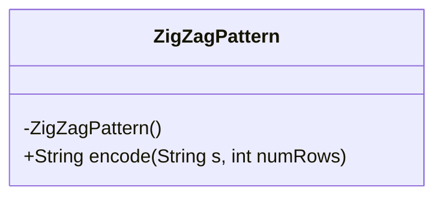
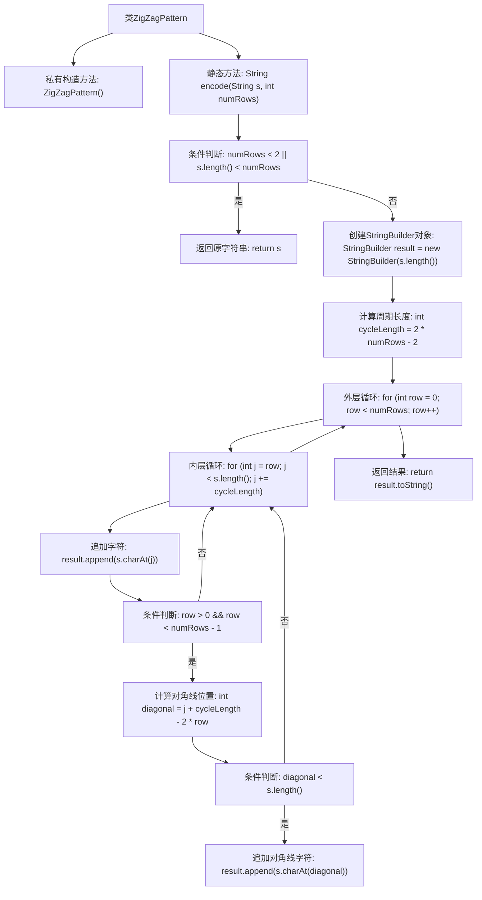

# 基础信息

|      |      |
|------|------|
| 名称 | ZigZagPattern |
| 编码语言 | .java |
| 代码路径 | Java/src/main/java/com/thealgorithms/strings/zigZagPattern/ZigZagPattern.java |
| 包名 | com.thealgorithms.strings.zigZagPattern |
| 依赖项 | [] |
| 概述说明 | ZigZagPattern类用于字符串的Z形编码。 |

# 说明

ZigZagPattern类用于实现字符串的Z形编码。该编码方法将字符串按特定行数排列成Z字形，然后按行读取字符以生成编码后的字符串。此类的主要功能是将输入的字符串转换为Z形排列，并输出最终的编码结果。通过这种方式，原始字符串的字符顺序被重新排列，形成一种特定的模式，便于后续处理或传输。ZigZagPattern类的实现确保了编码过程的准确性和效率，适用于需要特定字符排列的场景。

# 类列表 Class Summary

| 名称   | 类型  | 说明 |
|-------|------|-------------|
| ZigZagPattern | class | ZigZagPattern类实现字符串的Z形编码。 |

## 类 ZigZagPattern

|      |      |
|------|------|
| 访问范围 | final |
| 类型 | class |
| 名称 | ZigZagPattern |
| 说明 | ZigZagPattern类实现字符串的Z形编码。 |

### UML类图

这段代码定义了一个名为 `ZigZagPattern` 的 final 类，该类包含一个私有的构造函数和一个公有的静态方法 `encode`。`encode` 方法用于将输入字符串 `s` 按照指定的行数 `numRows` 进行 zig-zag 编码，并返回编码后的字符串。该方法首先检查行数是否小于 2 或字符串长度是否小于行数，如果是则直接返回原字符串。否则，它使用 `StringBuilder` 来构建结果字符串，通过计算周期长度并在每一行中进行字符的遍历和拼接，最终返回编码后的字符串。

### 内部方法调用关系图

这段代码实现了将输入字符串按照Z字形（ZigZag）模式进行编码的功能。首先，代码检查输入的行数是否小于2或字符串长度是否小于行数，如果是，则直接返回原字符串。否则，代码通过计算周期长度，并在双层循环中遍历字符串，按照Z字形模式将字符追加到结果中。最后，返回编码后的字符串。

### 字段列表 Field List

| 名称  | 类型  | 说明 |
|-------|-------|------|

### 方法列表 Method List

| 名称  | 类型  | 说明 |
|-------|-------|------|
| encode | String | Z字形编码算法，按行遍历字符串，生成Z字形排列结果。 |

