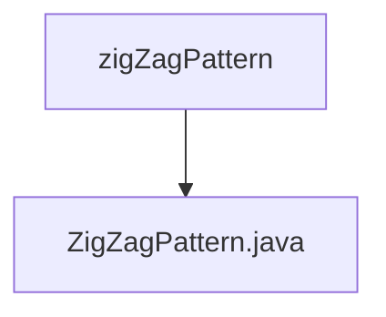

# 基础信息

|      |      |
|------|------|
| 名称 | zigZagPattern |
| 编码语言 | .java |
| 代码路径 | Java/src/main/java/com/thealgorithms/strings/zigZagPattern |
| 包名 | Java.src.main.java.com.thealgorithms.strings.zigZagPattern |
| 概述说明 | ZigZagPattern类用于字符串的Z形编码。 |

# 说明

ZigZagPattern类用于实现字符串的Z形编码。该编码方法将字符串按特定行数排列成Z字形，然后按行读取字符以生成编码后的字符串。此类的主要功能是将输入的字符串转换为Z形排列，并输出最终的编码结果。通过这种方式，原始字符串的字符顺序被重新排列，形成一种特定的模式，便于后续处理或传输。ZigZagPattern类的实现确保了编码过程的准确性和效率，适用于需要特定字符排列的场景。

### 包内部结构视图

该流程图展示了路径的层级关系，其中`zigZagPattern`是父目录，`ZigZagPattern.java`是子文件。这种结构清晰地表示了一个目录与其包含的单个文件之间的关系，适用于简单的文件层级展示。

# 文件列表 File List

| 名称   | 类型  | 说明 |
|-------|------|-------------|
| [ZigZagPattern.java](ZigZagPattern.md) | file | ZigZagPattern类用于字符串的Z形编码。 |

