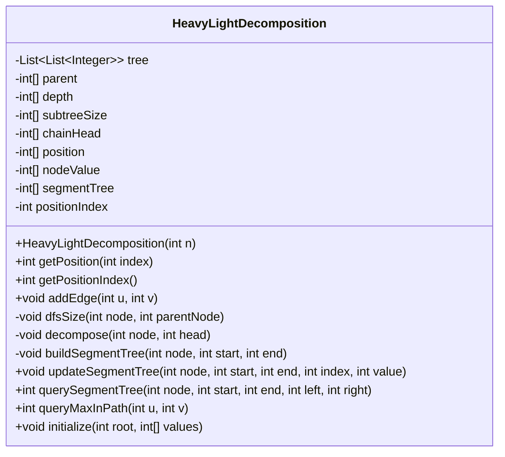

# 基础信息

|      |      |
|------|------|
| 名称 | HeavyLightDecomposition |
| 编码语言 | .java |
| 代码路径 | Java/src/main/java/com/thealgorithms/tree/HeavyLightDecomposition.java |
| 包名 | com.thealgorithms.tree |
| 依赖项 | ['java.util.ArrayList', 'java.util.List'] |
| 概述说明 | HeavyLightDecomposition类实现树分解，支持路径查询和更新。 |

# 说明

HeavyLightDecomposition类实现了树分解算法，主要用于处理树结构数据。该类支持对树中路径的最大值进行查询，同时也能对路径上的节点值进行更新操作。通过这种分解方法，可以高效地处理树上的路径查询和更新任务，适用于需要频繁操作树结构数据的场景。

# 类列表 Class Summary

| 名称   | 类型  | 说明 |
|-------|------|-------------|
| HeavyLightDecomposition | class | HeavyLightDecomposition类实现树分解，支持路径最大值查询和更新操作。 |

## 类 HeavyLightDecomposition

|      |      |
|------|------|
| 访问范围 | public |
| 类型 | class |
| 名称 | HeavyLightDecomposition |
| 说明 | HeavyLightDecomposition类实现树分解，支持路径最大值查询和更新操作。 |

### UML类图

**描述：**
`HeavyLightDecomposition` 类实现了重链剖分算法，用于在树结构中进行高效路径查询。它通过深度优先搜索（DFS）计算子树大小，并利用重链剖分将树分解为多条链。每个节点在剖分后获得唯一位置，构建线段树以支持区间查询和更新操作。`queryMaxInPath` 方法用于查询两个节点之间路径上的最大值，`initialize` 方法用于初始化树结构和线段树。

### 内部方法调用关系图

```mermaid
graph TD
    A["类HeavyLightDecomposition"]
    B["属性: List<List<Integer>> tree"]
    C["属性: int[] parent"]
    D["属性: int[] depth"]
    E["属性: int[] subtreeSize"]
    F["属性: int[] chainHead"]
    G["属性: int[] position"]
    H["属性: int[] nodeValue"]
    I["属性: int[] segmentTree"]
    J["属性: int positionIndex"]
    K["构造方法: HeavyLightDecomposition(int n)"]
    L["方法: int getPosition(int index)"]
    M["方法: int getPositionIndex()"]
    N["方法: void addEdge(int u, int v)"]
    O["私有方法: void dfsSize(int node, int parentNode)"]
    P["私有方法: void decompose(int node, int head)"]
    Q["私有方法: void buildSegmentTree(int node, int start, int end)"]
    R["方法: void updateSegmentTree(int node, int start, int end, int index, int value)"]
    S["方法: int querySegmentTree(int node, int start, int end, int left, int right)"]
    T["方法: int queryMaxInPath(int u, int v)"]
    U["方法: void initialize(int root, int[] values)"]

    A --> B
    A --> C
    A --> D
    A --> E
    A --> F
    A --> G
    A --> H
    A --> I
    A --> J
    A --> K
    A --> L
    A --> M
    A --> N
    A --> O
    A --> P
    A --> Q
    A --> R
    A --> S
    A --> T
    A --> U
```

这段代码实现了一个基于重链分解（Heavy-Light Decomposition）的树结构处理类。通过深度优先搜索（DFS）计算子树大小，并使用重链分解对树进行划分，以便高效地处理路径查询和更新操作。代码中包含了初始化树结构、构建线段树、更新线段树、查询线段树以及查询路径最大值等功能。重链分解技术通过将树分解为多个链，使得路径查询和更新操作的时间复杂度降低到O(log^2 n)，适用于处理大规模树结构问题。

### 字段列表 Field List

| 名称  | 类型  | 说明 |
|-------|-------|------|
| tree | List<List<Integer>> | 私有二维整数列表变量tree。 |
| subtreeSize | int[] | 私有整型数组存储子树大小。 |
| chainHead | int[] | 私有整型数组chainHead用于存储链头信息。 |
| positionIndex | int | 私有整型变量positionIndex用于存储位置索引。 |
| position | int[] | 声明一个私有整型数组变量position。 |
| segmentTree | int[] | 声明一个私有的整型数组segmentTree。 |
| nodeValue | int[] | 私有整型数组变量nodeValue。 |
| parent | int[] | 声明一个私有的整型数组parent。 |
| depth | int[] | 定义一个私有整型数组变量depth。 |

### 方法列表 Method List

| 名称  | 类型  | 说明 |
|-------|-------|------|
| initialize | void | 初始化函数，计算子树大小，分解树，赋值节点，构建线段树。 |
| getPositionIndex | int | 获取位置索引的方法。 |
| getPosition | int | 获取指定索引的位置值。 |
| dfsSize | void | 深度优先搜索计算子树大小，更新节点深度和父节点信息。 |
| updateSegmentTree | void | 更新线段树节点值，递归更新并维护最大值。 |
| querySegmentTree | int | 查询线段树节点在指定区间的最大值。 |
| decompose | void | 分解节点树，标记链头和位置，递归处理重子节点和其他子节点。 |
| queryMaxInPath | int | 查询路径u到v的最大值，使用链式分解和线段树。 |
| addEdge | void | 方法addEdge用于在树中添加双向边，连接节点u和v。 |
| buildSegmentTree | void | 递归构建线段树，节点值取左右子节点最大值。 |

