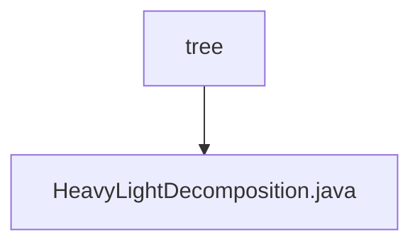

# 基础信息

|      |      |
|------|------|
| 名称 | tree |
| 编码语言 | .java |
| 代码路径 | Java/src/main/java/com/thealgorithms/tree |
| 包名 | Java.src.main.java.com.thealgorithms.tree |
| 概述说明 | HeavyLightDecomposition类实现树分解，支持路径查询和更新。 |

# 说明

HeavyLightDecomposition类实现了树分解算法，主要用于处理树结构数据。该类支持对树中路径的最大值进行查询，同时也能对路径上的节点值进行更新操作。通过这种分解方法，可以高效地处理树上的路径查询和更新任务，适用于需要频繁操作树结构数据的场景。

### 包内部结构视图

该流程图展示了路径的层级关系，`tree`文件夹下包含`HeavyLightDecomposition.java`文件。路径结构简洁明了，反映了文件与文件夹之间的从属关系，便于理解项目中的文件组织方式。

# 文件列表 File List

| 名称   | 类型  | 说明 |
|-------|------|-------------|
| [HeavyLightDecomposition.java](HeavyLightDecomposition.md) | file | HeavyLightDecomposition类实现树分解，支持路径查询和更新。 |

